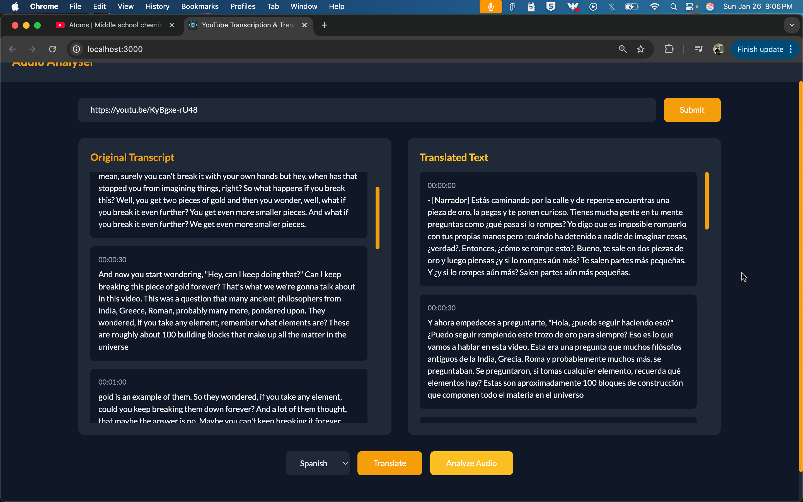
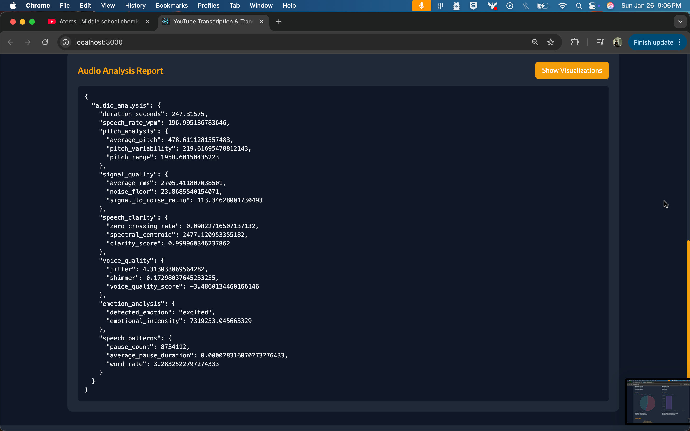

# Audio Analyser

Audio Analyser is a powerful tool for analyzing, transcribing, and translating audio content from YouTube videos. It provides detailed insights into audio characteristics, speech patterns, and emotional content, along with accurate transcription and translation capabilities.

## Features

- **Audio Analysis**
  - Pitch analysis (average, variability, range)
  - Signal quality metrics (RMS, noise floor, SNR)
  - Voice quality assessment (jitter, shimmer, quality score)
  - Emotion detection and intensity analysis
  - Speech pattern analysis (pause count, duration, word rate)

- **Transcription & Translation**
  - Accurate YouTube video transcription
  - Multi-language translation support
  - Real-time translation streaming
  - Timestamped transcript segments

- **Visualization**
  - Interactive charts and graphs
  - Detailed audio metrics visualization
  - Comparative analysis views
  - Raw data and visual toggle

## Technology Stack

### Backend
- Python 3.12
- FastAPI
- yt-dlp
- SciPy
- NumPy
- NLTK

### Frontend
- React.js
- Tailwind CSS
- Chart.js
- Axios

## Installation

### Backend Setup

1. Clone the repository:
   ```bash
   git clone https://github.com/yourusername/audio-analyser.git
   cd audio-analyser/backend
   ```

2. Create a virtual environment:
   ```bash
   python -m venv venv
   source venv/bin/activate  # On Windows: venv\Scripts\activate
   ```

3. Install dependencies:
   ```bash
   pip install -r requirements.txt
   ```

4. Start the server:
   ```bash
   uvicorn main:app --reload
   ```

### Frontend Setup

1. Navigate to the frontend directory:
   ```bash
   cd ../frontend
   ```

2. Install dependencies:
   ```bash
   npm install
   ```

3. Start the development server:
   ```bash
   npm start
   ```

## Usage

1. Open the application in your browser (default: http://localhost:3000)
2. Enter a YouTube video URL
3. View the transcription and analysis results
4. Use the translation feature to translate the transcript
5. Explore the detailed audio analysis visualizations

## Screenshots







## API Documentation

The backend API is documented using Swagger UI. After starting the server, visit:

```
http://localhost:8000/docs
```

## Configuration

Create a `.env` file in the backend directory with the following variables:

```
API_KEY=your_api_key_here
```

## Contributing

We welcome contributions! Please follow these steps:

1. Fork the repository
2. Create a new branch (`git checkout -b feature/YourFeatureName`)
3. Commit your changes (`git commit -m 'Add some feature'`)
4. Push to the branch (`git push origin feature/YourFeatureName`)
5. Open a pull request

## License

This project is licensed under the MIT License - see the [LICENSE](LICENSE) file for details.

## Acknowledgments

- [FastAPI](https://fastapi.tiangolo.com/) for the backend framework
- [React](https://reactjs.org/) for the frontend framework
- [Chart.js](https://www.chartjs.org/) for data visualization
- [yt-dlp](https://github.com/yt-dlp/yt-dlp) for YouTube video processing

## I have used Locally running LLM on my System. Feel free to use whatever you want.

## Contact

For any inquiries, please contact [aman1024soni@gmail.com](mailto:aman1024soni@gmail.com)